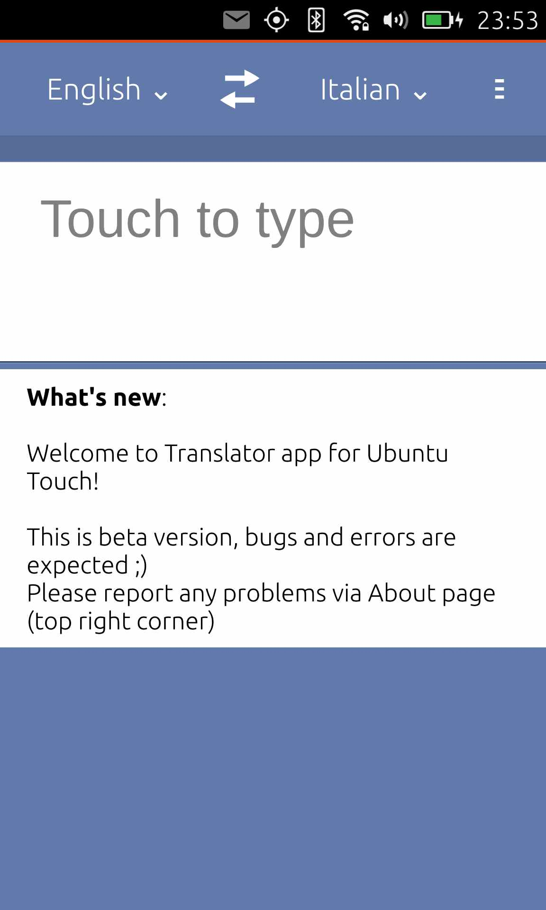

---
# Translator
__Simple online translator application for__ __[Ubuntu Touch](https://ubuntu-touch.io/)__ (mobile OS).

- Supported languages; Albanian Arabian Armenian Azeri Belarusian Bosnian Bulgarian Catalan Croatian Czech Chinese Danish Dutch English Estonian Finnish French Georgian German Greek Hebrew Hungarian Icelandic Indonesian Italian Japanese Korean Latvian Lithuanian Macedonian Malay Maltese Norwegian Polish Portuguese Romanian Russian Spanish Serbian Slovak Slovenian Swedish Thai Turkish Ukrainian Vietnamese.
- Simple to use
- Save translation to favorites
- Translation history
- Ability to invert translation
- Cool animations
- Using external API from __[yandex](https://translate.yandex.com/)__
- Absolutely free, can be downloaded from __[OpenStore](https://open-store.io/app/com.ubuntu.developer.majster-pl.translator-app)__

---

### Pictures:
__Few pictures of application in action__

